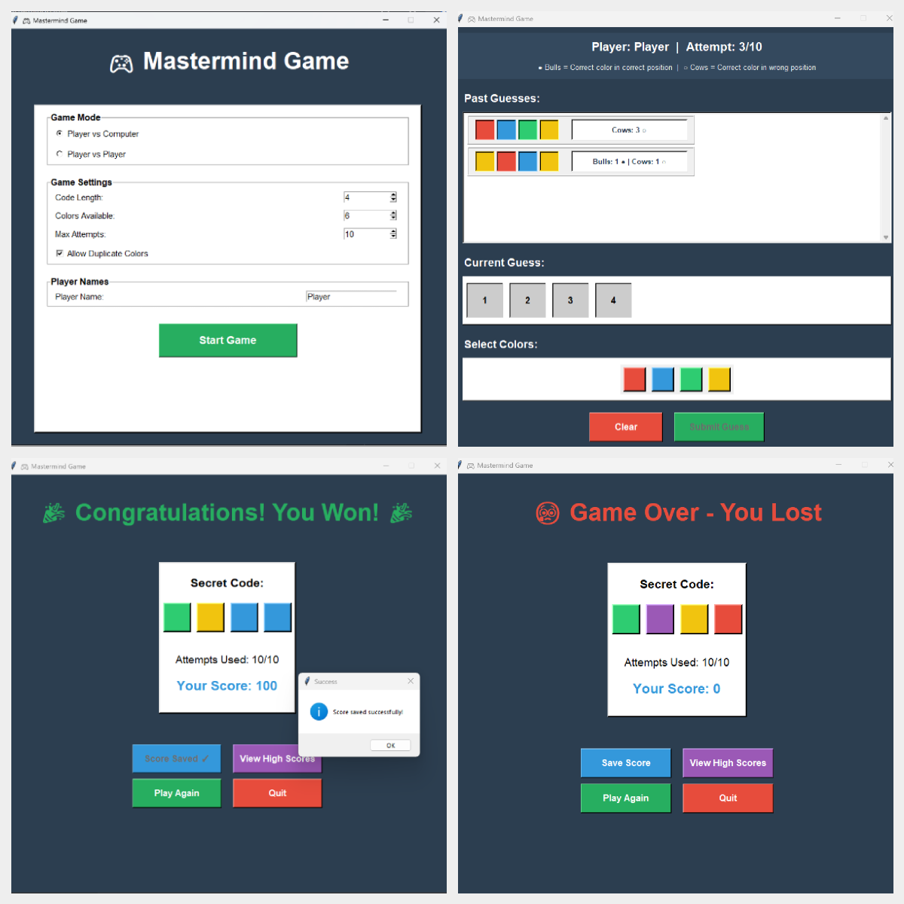

<p align="center">
  
</p>

<br>

# 🎮 Mastermind Game (Python)

A complete implementation of the classic **Mastermind** logic game with both **command-line** and **graphical user interface (GUI)** options. Features multiple game modes, scoring system, and persistent leaderboard. Built to demonstrate clean software design, testing, and CI/CD automation principles using Python.
<br>
[Mastermind Wikipedia (Game)](https://de.wikipedia.org/wiki/Mastermind_(Spiel))

---
## 🛠 Tech Stack & Tools

<p align="left">

  
  
  
  
  
  
  
  
  
  

</p>

</p>

## 🚀 Quick Start

### 1. Create and activate environment
```bash
conda env create -f environment.yml
conda activate mastermind
```

### 2. Install the package
```bash
pip install -e .
```

### 3. Play the game

**🎨 GUI Mode (Recommended)**
```bash
# Launch the graphical interface
python -m mastermind.gui.app

# Or directly
python src/mastermind/gui/app.py
```

**💻 Command-Line Mode**
```bash
# Player vs Computer (default)
mastermind

# Player vs Computer with custom settings
mastermind --mode pvc --max-attempts 10

# Player vs Player mode
mastermind --mode pvp --max-attempts 8

# Custom rules
mastermind --length 5 --alphabet ABCDEF --no-duplicates --max-attempts 12
```

### 4. Run tests
```bash
pytest
```

---

## 🐳 Docker Support (CLI Only)

This project includes an official Docker image for the **CLI version**
of Mastermind.


### Pull from Docker Hub
 <br>
 
[](https://hub.docker.com/repository/docker/alivaezii/mastermindgame)


 <br>

``` bash
docker pull alivaezii/mastermindgame:1.0.0

```

### Run the game in Docker

``` bash
docker run --rm -it alivaezii/mastermindgame:1.0.0
```

### Run with custom arguments

``` bash
docker run --rm -it alivaezii/mastermindgame:1.0.0 --mode pvc --max-attempts 12
docker run --rm -it alivaezii/mastermindgame:1.0.0 --no-duplicates --length 5
```

### Build locally (optional)

``` bash
docker build -t mastermindgame .
```


---

## 🎯 Features

### Dual Interface

**🎨 Graphical User Interface (GUI)**
- Beautiful color-based visual interface using Tkinter
- Interactive color selection with clickable buttons
- Visual feedback with bulls (●) and cows (○) indicators
- Scrollable guess history
- High scores leaderboard with professional table layout
- Intuitive navigation between screens
- Modern dark theme with vibrant colors

**💻 Command-Line Interface (CLI)**
- Traditional text-based gameplay
- Perfect for terminal enthusiasts
- Lightweight and fast

### Game Modes

**Player vs Computer (PvC)**
- Computer generates a random secret code
- Player tries to guess the code
- Default mode

**Player vs Player (PvP)**
- Player 1 sets a secret code (hidden input in CLI, visual in GUI)
- Player 2 tries to guess the code
- Great for playing with friends!

### Scoring System

- **Win**: Base score of 100 + bonus for remaining attempts (10 points each)
- **Loss**: 0 points
- Scores are automatically saved to `scores.json`
- Top 5 scores displayed after each game

**Example Scoring:**
- Win in 3/10 attempts: 100 + (7 × 10) = **170 points**
- Win in 10/10 attempts: 100 + (0 × 10) = **100 points**
- Loss: **0 points**

### Configurable Rules

- **Code length**: Default 4, customizable via `--length`
- **Alphabet**: Default "012345", customizable via `--alphabet`
- **Duplicates**: Allowed by default, disable with `--no-duplicates`
- **Max attempts**: Default 10, customizable via `--max-attempts`


## 🎮 Mastermind Game: UI Overview

Below is a complete overview of the Mastermind game's graphical interface, showing all major gameplay states:

1. **Start Screen & Settings**
2. **In-Game Screen (Player vs Computer)**
3. **Winning Screen**
4. **Game Over Screen**


<p align="center">
  
</p>


---

## 🧪 Testing & Code Quality

This project follows a lightweight yet strict **Testing and Quality Policy**:

| Area | Tool | Purpose |
|------|------|----------|
| **Testing** | `pytest` + `pytest-cov` | Unit & CLI tests, min. 85% coverage |
| **Formatting** | `black` + `isort` | Code formatting & import sorting |
| **Linting** | `flake8` | Static code analysis |
| **Pre-commit** | `pre-commit` | Auto-runs all checks before pushing |
| **CI/CD** | GitHub Actions | Multi-version tests (Python 3.10 & 3.11) |

📄 For full details: [Quality & CI/CD Policy](./docs/Quality_Testing_CICD_Policy.md)

---

## 📂 Project Structure

```
mastermindgame/
│
├── src/mastermind/
│   ├── __init__.py          # Package exports
│   ├── engine.py            # Core rules and validation logic
│   ├── game.py              # Game state management
│   ├── scoreboard.py        # Scoring and persistence
│   ├── cli.py               # Command-line interface
│   └── gui/                 # Graphical user interface (Sprint 3)
│       ├── __init__.py
│       ├── app.py           # Main GUI application controller
│       ├── utils.py         # Color-symbol mapping utilities
│       ├── screens/         # All game screens
│       │   ├── start.py     # Game configuration screen
│       │   ├── secret.py    # PvP secret selection
│       │   ├── gameboard.py # Main gameplay interface
│       │   ├── gameover.py  # Results & scoring
│       │   └── highscores.py # Leaderboard display
│       └── widgets/         # Reusable UI components
│           ├── colorpicker.py # Color selection widget
│           └── row.py       # Guess row display
│
├── tests/
│   ├── test_engine.py       # Engine unit tests
│   ├── test_game.py         # Game class tests
│   ├── test_scoreboard.py   # Scoreboard tests
│   ├── test_cli.py          # CLI integration tests
│   └── test_gui_utils.py    # GUI utilities tests
│
├── scores.json              # Persistent scoreboard (auto-created)
├── environment.yml          # Conda environment
├── pyproject.toml           # Project configuration
└── .github/workflows/ci.yml # CI/CD pipeline
```

---

## 🏗️ Architecture

The codebase is organized into clean, testable modules:

- **`engine.py`**: Pure functions for game rules (`Rules`, `validate_guess`, `score`)
- **`game.py`**: `Game` class encapsulating game state and logic, supporting both PvC and PvP modes
- **`scoreboard.py`**: Score calculation and JSON persistence (`ScoreEntry`, `calculate_score`, `save_score`, `load_scores`, `top_scores`)
- **`cli.py`**: Command-line user interface, completely decoupled from game logic
- **`gui/`**: Graphical user interface (Sprint 3)
  - **MVC Architecture**: Clean separation of Model (Game), View (screens/widgets), Controller (app navigation)
  - **Color Mapping**: Translates visual colors to game engine symbols
  - **Reusable Widgets**: ColorPicker and GuessRow components
  - **No Logic Duplication**: GUI calls existing Game and scoreboard functions

This separation makes the codebase easy to extend (e.g., adding a web interface) without modifying core logic.

---

## 📖 Usage Examples

### Basic Game (PvC)
```bash
mastermind
```

### Player vs Player
```bash
mastermind --mode pvp
```

### Hard Mode (no duplicates, limited attempts)
```bash
mastermind --no-duplicates --max-attempts 5
```

### Custom Alphabet
```bash
mastermind --alphabet RGBYOP --length 6
```

---

## ⚙️ Continuous Integration (CI)

All commits and pull requests trigger an automated workflow that performs:

1. Environment setup via **Conda**
2. Auto-formatting using **isort** and **black**
3. Linting with **flake8**
4. Running **pytest** for all unit and CLI tests
5. Enforcing **coverage ≥ 85%**

If all stages pass, the build turns ✅ green in GitHub Actions.

---

## 🤝 Contributing

1. Fork this repository  
2. Create a new branch: `feature/my-feature`  
3. Run local quality checks before committing:
   ```bash
   isort . && black . && flake8 . && pytest
   ```
4. Submit a Pull Request, all CI jobs must pass before merge.

---

## 🧱 Built With
- Python 3.10 / 3.11
- Conda environment management
- pytest + coverage
- black / isort / flake8 / pre-commit
- GitHub Actions for CI/CD automation

---

## 📝 License


### Mastermind Game: Team Information
Developed by **TM26 -Hochschule Campus Wien**
<br>
MIT License © 2025  
<br>
A student software engineering project at Hochschule Campus Wien  
<br>
Sprint-based development following **SCRUM**

<br>

| Role | Name | Contact |
|------|------|---------|
| Product Owner | **Laurenz** | laurenz.stelzl@stud.hcw.ac.at |
| Scrum Master | **Markus** | markus.maximus@stud.hcw.ac.at |
| Senior Developer & Tester | **Ali** | mohammadali.vaezi@stud.hcw.ac.at |
| Python Developer | **Adnan** | adnan.eminovic@stud.hcw.ac.at |
| Python Developer | **Hossein** | seyed.meymandi.nezhad@stud.hcw.ac.at |


<br>


---

## 📘 Project Documentation

This project includes full Agile documentation, test specifications, retrospectives, architecture diagrams, and development guidelines.

[](https://github.com/alivaezii/mastermindgame/wiki)

---


### 💡 Related Documentation
- [Quality Assurance & CI/CD Policy](./docs/Quality_Testing_CICD_Policy.md)
- [Python ↔ Java Toolchain Comparison](./docs/Python_vs_Java_Tooling.md)


